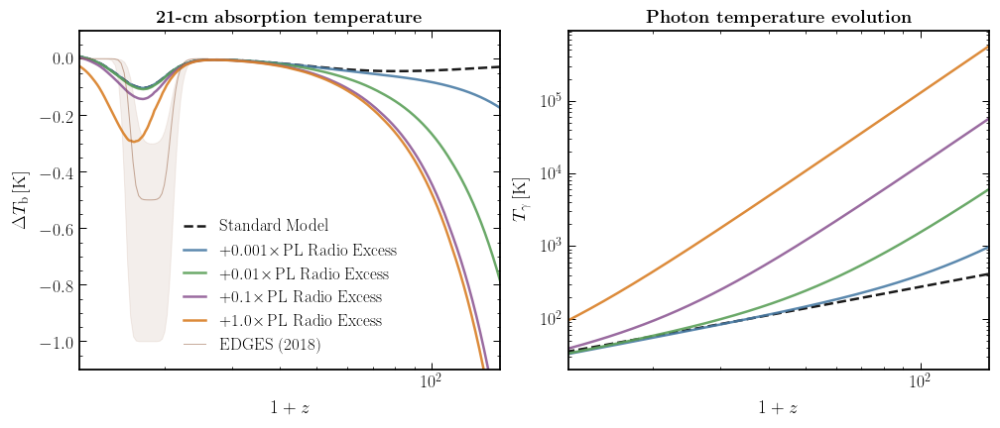

# twentyone-global

Simplified framework for modeling the global 21-cm absorption signal, with a focus on studying the implications of non-standard 21-cm CMB temperature evolution. For details about the model, see [2009.xxxx](https://arxiv.org/abs/2009.xxxx).

[](https://opensource.org/licenses/MIT)
[](https://arxiv.org/abs/2009.xxxxx)



Derived 21-cm absorption temperature (left) for various amounts of excess power-law photon temperature parameterization (right) from [Fialkov and Barkana (2019)](https://arxiv.org/abs/1902.02438).

## Code

The dependencies of the code are listed in [environments.yml](environment.yml). In addition to the usual Python scientific stack, the `astropy`, `classy`, `COLOSSUS`, and `tqdm` packages are required.

## Notebooks

- The notebook [01_basic_examples.ipynb](notebooks/01_basic_examples.ipynb) contains basic high-level examples for running the code.
- The notebook [02_advanced_usage.ipynb](notebooks/02_advanced_usage.ipynb) describes components of the code that can be used for finer control over the X-ray and Ly-A emitting populations.

## Authors

-  Andrea Caputo; andrea dot caputo at uv dot es
-  Hongwan Liu; hongwanl at princeton dot edu
-  Siddharth Mishra-Sharma; sm8383 at nyu dot edu
-  Maxim Pospelov; pospelov at umn dot edu
-  Joshua T. Ruderman; ruderman at nyu dot edu
-  Alfredo Urbano; alfredo dot urbano at sissa dot it

## References

If you use this code, please cite:

```
@article{Caputo:2020xxx,
    author = "Caputo, Andrea and Liu, Hongwan and Mishra-Sharma, Siddharth and Pospelov, Maxim and Ruderman, Joshua T. and Urbano, Alfredo",
    archivePrefix = "arXiv",
    eprint = "2009.xxxxx",
    month = "9",
    primaryClass = "astro-ph.CO",
    title = "{Edges and Endpoints in 21-cm from Resonant Photon Production}",
    year = "2020"
}
```

Various components of the code are based on [astro-ph/0507102](https://arxiv.org/abs/astro-ph/0507102), [1804.02406](https://arxiv.org/abs/1804.02406), [0910.4410](https://arxiv.org/abs/0910.4410), [0802.2102](https://arxiv.org/abs/0802.2102), [1312.4948](https://arxiv.org/abs/1312.4948), and [1904.09296](https://arxiv.org/abs/1904.09296).